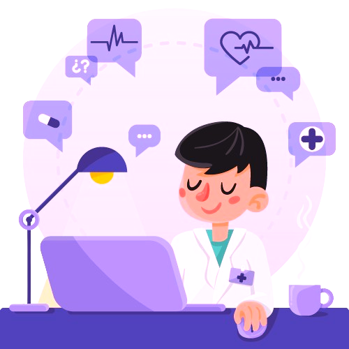
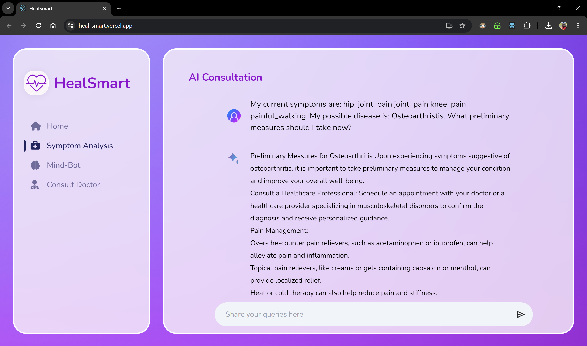
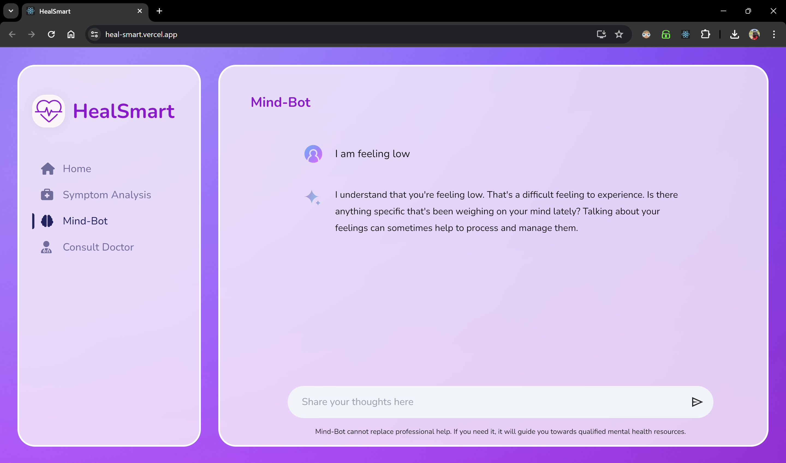
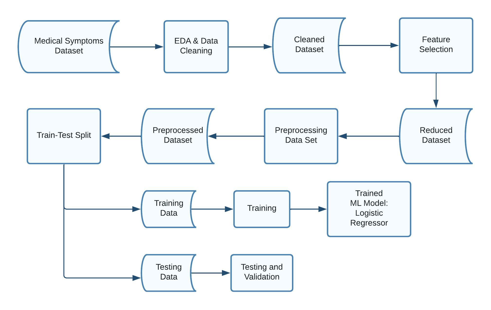

# HealthGenie.AI: Your Medical Assistant 👩‍⚕️
<div align="center"> Your Health, Our Help</div>
  <br>
  <p align="center">
    
  </p>

## Overview 📈
Welcome to HealthGenie.AI 👩‍⚕️, your personalized AI-powered medical assistant 🩺. Our mission is to revolutionize healthcare by providing personalized recommendations for optimal well-being 🤒, seamless connections with specialist professionals ⚕️, and holistic mental health support. By harnessing cutting-edge technologies like Machine Learning and Generative AI, we empower you to take control of your health and make informed decisions. Join the community today and start thriving!

## Try it Out 

**[Visit Site](https://heal-smart.vercel.app/)**

## Key Features  ✨✨

<br>
<p align="center">
    
</p>


- **Symptom Analysis: 🤒😷** Predict diseases from symptoms using ML model, guiding users to specialist doctors and offering AI-driven recommendations.<br>

- **Mind-Bot: 🧠** Provide empathetic mental health support through friendly conversations, addressing loneliness and stress with sensitivity using GenAI.<br>
 
- **Consult Doctor: ⚕️🩺** Streamline finding and booking appointments with specialists, offering user-friendly interfaces and utilising Firebase for healthcare provider databases.<br>
 
- **Intuitive Design: 🎨** Ensure a seamless and intuitive design for easy navigation and interaction, enhancing the overall user experience.<br>

- **Enhanced Accessibility 💻: **  Access healthcare recommendations and mental health support anytime, anywhere, through both web and mobile platforms.<br>

- **Personalised Recommendations: 👍** Tailor healthcare suggestions based on symptom analysis and user ratings, ensuring efficient and effective care.<br>

## Technologies Used 🏹🎬
- **Frontend:** React JS, HTML, Styled Components, Tailwind CSS<br>
- **Backend:** Python (Flask)<br>
- **ML Algorithm:** Logistic Regression<br>
- **ML Libraries:** pandas, numpy, scikit-learn<br>
- **APIs:** Gemini API 🇬 Google<br>
- **Database:** Firebase Firestore<br>
- **Tools:** Google Collab, Google AI Studio, Postman, VS Code<br>

## Demo

### Screenshots
<div align="center">
    Home Page
    
    Symptom Analysis
    
</div>
<div align="center">
    Analysis Result
    
    AI Consultation
    
</div>
<div align="center">
    Mind-Bot Response
    
</div>
<div align="center">
    Doctor Appointment
    
    
</div>

## Design Idea & Approach 🚀

### Architecture 🎯
<p align="center">
    
</p>
HealthGenie.AI offers a comprehensive healthcare solution 🏥, leveraging modern technologies and user-friendly design principles. The architecture is divided into three main sections:<br>

1️⃣ Symptom Analysis 🤔: HealSmart diagnoses diseases based on symptoms using a Flask API connected to a trained ML model. It guides users to the right specialist doctor and offers AI-driven chatbot suggestions.<br>

2️⃣ Mind-Bot 🤖: This chat app, powered by Google's Gemini API, provides empathetic consultations for mental health concerns like loneliness and anxiety.<br>

3️⃣ Consult Doctor 👨‍⚕: HealSmart enables users to find and book appointments with doctors across various specialties. Users can explore profiles, view ratings, and check availability.<br>

### Data Set Desciption 💾
- Link to Dataset: https://www.kaggle.com/datasets/kaushil268/disease-prediction-using-machine-learning

### Machine Learning Lifecycle 🤖

<p align="center">
    
</p>

## Setup Instructions 👨🏿‍💻

### Setting up the ML Model API locally 🔄

1. Make sure you have the following installed:
   - Python (version 3.x)
   - pip (Python package installer)
   - Virtual environment (optional but recommended)
2. Navigate to the `server` directory in the project.
3. Create a Python virtual environment using the command (optional):
   ```
   virtualenv venv
   ```
4. Activate the virtual environment (only if you have followed step 3):
   - On Unix/Linux:
     ```
     source venv/bin/activate
     ```
   - On Windows:
     ```
     venv\Scripts\activate
     ```
5. Install Python dependencies by running:
   ```
   pip install -r requirements.txt
   ```
6. Run the development server using:
   ```
   flask run
   ```
7. Access the API at `http://localhost:5000/predict`.
   - Method: POST
   - Content-Type: Application/JSON
   - Sample Body:
     ```json
     { "symptoms": ["hip_joint_pain", "joint_pain", "knee_pain", "painful_walking"]}
     ```
   - Sample Response:
     ```json
     {"prediction": "Osteoarthritis"}
     ```

### Running the HealthGenie.AI Locally 🛠️
To run the project:

1. Install NodeJS (LTS) and npm.
2. Clone the repository.
3. Run:

npm install
cd frontend
npm install
npm start

4. Access the app at http://localhost:3000.
## Use Cases 💁‍♂️

- **Symptom Analysis and Diagnosis:** Input symptoms to get potential diagnoses and find relevant specialist doctors.

- **Mental Health Support & Post-appointment followup:** Engage in empathetic conversations for mental health guidance and professional help suggestions.

- **Doctor Consultation:** Find, view profiles, and proceed for booking healthcare providers.

- **Disease Management:** Track symptoms and receive personalized recommendations for effective management.

## Social Impact 📈
- **Mental Health Support:** 
- **Improved Quality:** 
- **Preventive Care:** 
- **Crisis Response:** 

## Scopes of Improvement 🌱

- **User Login:** Create an authentication system for users so that they can store their data always.
- **Integration of Telemedicine:** Facilitate virtual consultations for user convenience.
- **User Experience Refinement:** Gather feedback for intuitive interface enhancements.
- **Comprehensive Data Security:** Strengthen privacy measures for user trust and compliance.
